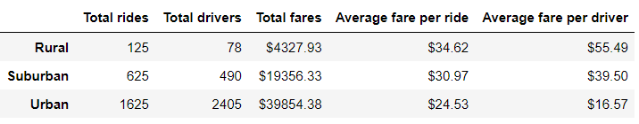
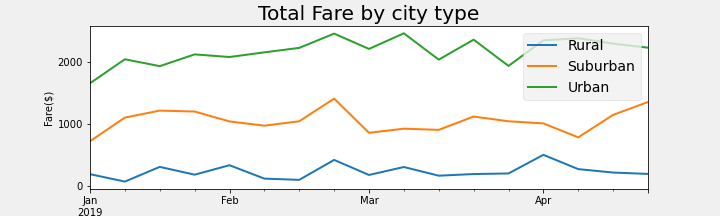
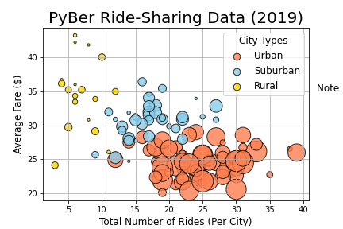

**PyBer Rideshare data analysis**

**Overview of the analysis:**

I am analysing the data of a ride sharing company Pyber. Purpose of this ananlysis is to find metrics that will increase accessibility of the rides sharing app Pyber and improve affordability of the service in under served neighborhood like rural cities.

**Results:**

Based on my analysis first just look at the profitability, The below data is clear in showing the Urban and suburban cities bring in the most profit. The reasons are obvious jobs like most office jobs are in the urban and suburban areas , However we are trying to increase iur accessability in rural areas too.

The differences in ride-sharing data below shows how Urban and suburban area have most drivers ,rides and hence those locations bring in most profits.

Average fare for a ride in rural is $34.62 compared to Urban that is $24.53, Total rides also less in rural areas 125 compares to urban 1625.

Recommendations to improve accessibility and affordability of Pyber app : 

1. There are few ways to Reduce average cost per ride in rural areas,Pyber can reduce cost per ride by increasing ride count,reduce cost involved to operate in rural areas ,  advertise the app and its easy of use in social media targetting the rural locations we are try to reach. when we get more ride shares we will be able to reduce the average cost per ride. 

2. Pyber should exploring opportunities for partnerships with rural businesses ,mobile service provider to design an incentive plan like "use Pyber for your employee rides and get certain incentives" this will incraese accessibility in these rural neighnorhood.

3. From the analysis above we can only see we have less rides in rural areas , we do need more data to improve rural pyber performance, Pyber should identify rural needs such as on-demand rides for elderly and evaluate the challenges in rural areas.